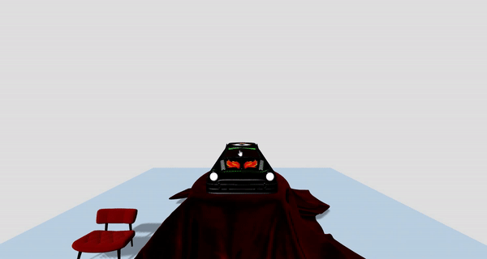

# A-Frame-Clipping-Plane-Component



### **Description / Rationale**
This is an A-Frame component, which demonstrates clipping planes. It was developed based on corresponding <a href="https://threejs.org/examples/webgl_clipping.html">example</a> provided by Three.js library. However it also has some distinguishing features: 
* Clipping direction option.
* Loading GLTF files.
* Manipulating clipping plane using mouse scroll event or touchmove event
* Enabling double-sided meshes.     

### **Instructions**
In order to use the component attach "clipping-plane" to an entity. The component has the following attributes: 
* <b>gltfURL: { type: 'string', default: '' }</b> - URL of the GLTF file.
* <b>gltfPosition: { type: 'vec3', default: { x: 0, y: 0, z: 0 } }</b> - GLTF position in 3D scene.
* <b>gltfScale: { type: 'vec3', default: { x: 1, y: 1, z: 1 } }</b> - GLTF scale in 3D scene. 
* <b>clippingDirection: { type: 'string', default: 'top-to-bottom' }</b> - Direction of the clipping plane or from where it should move. Has the following options: "top-to-bottom" (on Y-axis), "bottom-to-top" (on Y-axis), "front-to-back" (on Z-axis), "back-to-front" (on Z-axis), "left-to-right" (on X-axis), "right-to-left" (on X-axis).  
* <b>gltfMatSide: { type: 'boolean', default: false }</b> - Whether mesh should have double sided material.
* <b>planeConstant: { type: 'float', default: 2.0 }</b> // Original clipping plane locaion on X or Y or Z axis. It is from where it starts.
* <b>minScrollValue: { type: 'float', default: -1.0 }</b> - Minimal value beyond which clipping plane will not go. X or Y or Z axis.
* <b>maxScrollValue: { type: 'float', default: 2.0 }</b> - Maximal value beyond which clipping plane will not go. X or Y or Z axis
* <b>mouseScrollSpeed: { type: 'float', default: 0.0005 }</b> - Mouse scrolling speed or delta. 
* <b>touchScrollSpeed: { type: 'float', default: 0.01 }</b> - Touch based scrolling speed or delta.

The code below shows the sample implementation of the component. Please make sure to disable default lights in scene so that the component takes over (light="defaultLightsEnabled: false"):
```
<!DOCTYPE html>
<html lang="en">
<head>
    <title>SpotLight Texture Component (aka Texture projection)</title>
    <meta charset="utf-8">
    <meta name="viewport" content="width=device-width, user-scalable=no, minimum-scale=1.0, maximum-scale=1.0">
    <script src="https://aframe.io/releases/1.4.2/aframe.min.js"></script>
    <script src="js/spotlight-texture-component.js"></script>
</head>
<body>
    <a-scene light="defaultLightsEnabled: false" 
    spotlight-texture="
    lightHelper: true; 
    spotlightShadow: true; 
    spotlightDynamic: true;
    spotlightColor: #ffffff;
    spotlightIntensity: 15;
    spotlightDistance: 90;
    spotlightAngle: 0.5;
    spotlightPenubra: 1;
    spotlightDecay: 2;
    spotlightFocus: 1;
    spotlightPosition: 0, 40, 0;
    imgTexture: false;
    imgTextureSrc: textures/uvGrid.jpg;
    videoTextureSrc: textures/trailer.mp4
    ">
        <a-camera position="0 15 20"></a-camera>
        <a-box scale="10 10 10" position="-20 5 0" shadow="cast: true"></a-box>
        <a-gltf-model src="models/soldier.glb" scale="10 10 10" rotation="0 180 0" shadow="cast: true"></a-gltf-model>
        <a-sky color="#000000"></a-sky>
    </a-scene>
</body>
</html>
```

### **Tech Stack**
The project is powered by AFrame and Three.js. The video used in the example was taken from <a href="https://media.w3.org/2010/05/sintel/">here</a> and image textures from <a href="https://github.com/mrdoob/three.js/tree/master/examples/textures">Three.js repository</a>.

### **Demo**
See demo of the component here: [Demo](https://spotlight-texture.glitch.me/)
